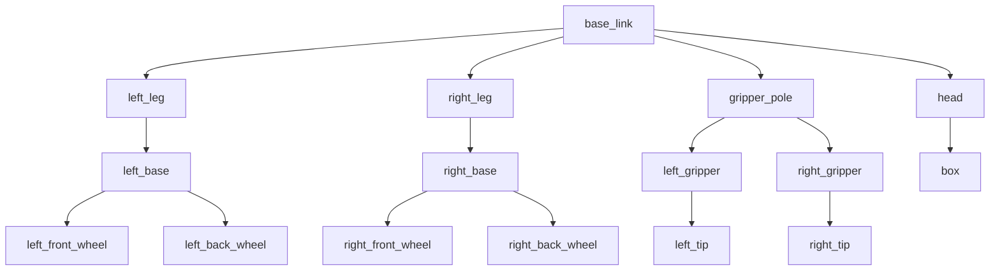

# ROS 2 TF
## What is ROS 2 TF
**TF (Transform)** is a library used to keep track of coordinate frames and their relationships over time. It allows robots to understand where objects and parts of themselves are in 3D space, enabling tasks like localization, navigation, and manipulation. For example, it handles transformations between the robot base, sensors, and the world.

## TF Tools
If you want to visualize the relation of the different TF's in a file use the following command to generate a PDF with a mermaid graph.
```bash
ros2 run tf2_tools view_frames
```



## Viewing TFs
To view a urdf file that has TFs in it use the following command.
```bash
ros2 launch urdf_tutorial display.launch.py model:=/opt/ros/humble/share/urdf_tutorial/urdf/08-macroed.urdf.xacro
```
